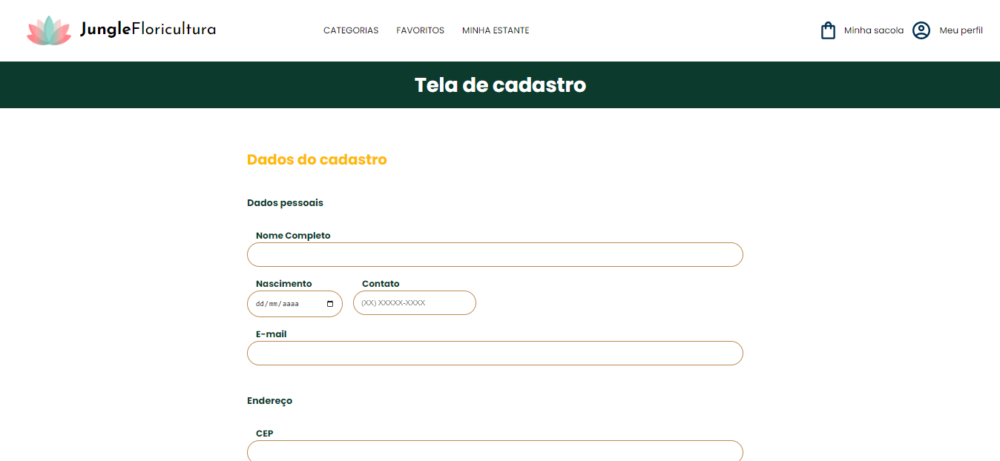
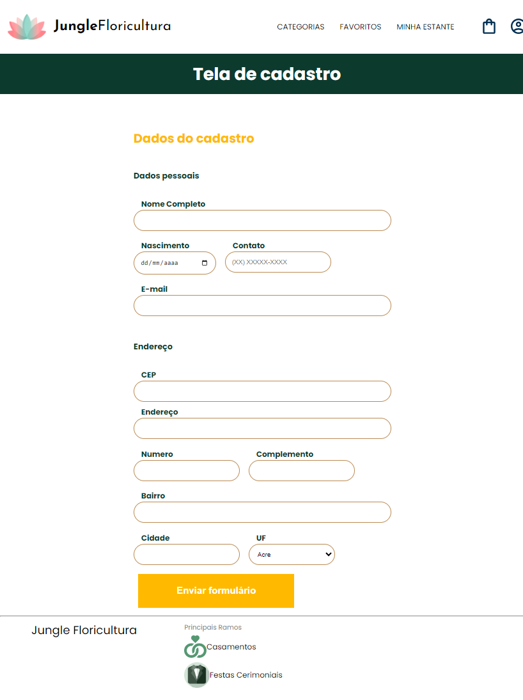
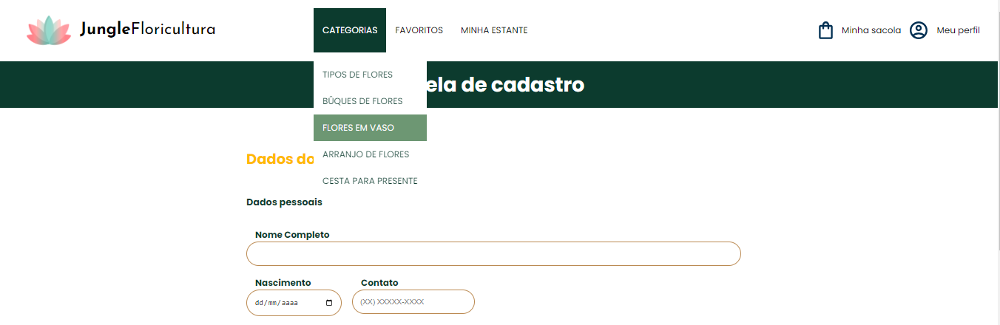
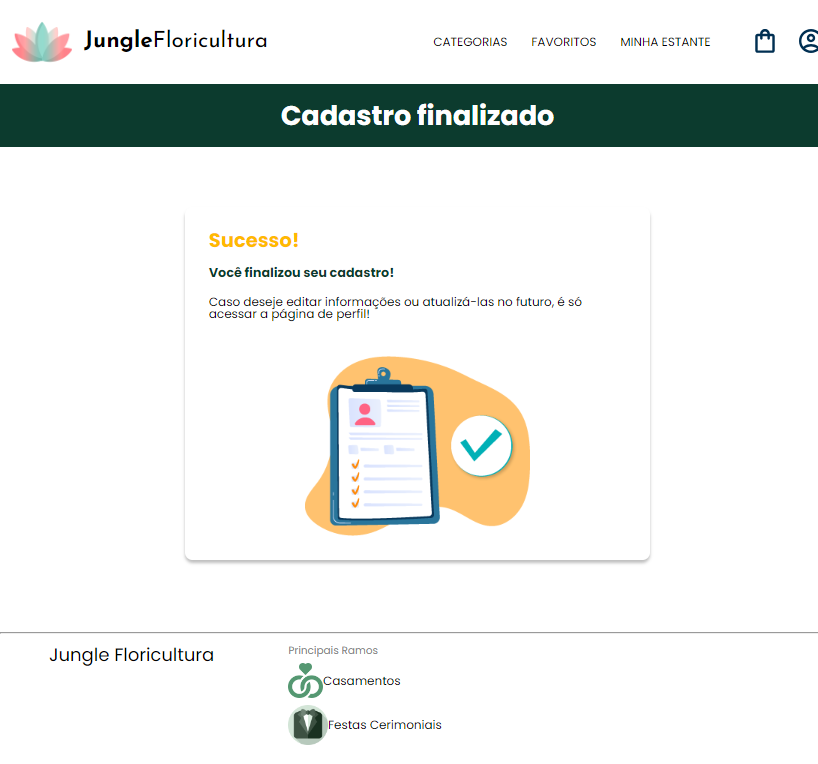

  

  

Um formulário de cadastro da plataforma Jungle Floricultura, uma floricultura com sua plataforma de vendas on-line que vende diversos tipos de flores e diferentes tipos de categorias como Bûques de Flores. Nesse formulário implementei o auto preenchimento de informações do endereço através do valor do CEP inserido pelo usuário.

## Tecnologias utilizadas no projeto
* HTML
* CSS
* Javascript

## Um Pouco do Projeto
<ul>
  <li> <h2>Tela de Cadastro</h2> </li>
    

    

    
  <li> <h2>Tela de Cadastro Finalizado</h2> </li>
    

</ul>
